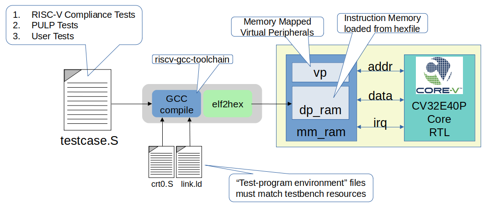

..
   Copyright (c) 2020,2025 OpenHW Group

   Licensed under the Solderpad Hardware Licence, Version 2.0 (the "License");
   you may not use this file except in compliance with the License.
   You may obtain a copy of the License at

   https://solderpad.org/licenses/

   Unless required by applicable law or agreed to in writing, software
   distributed under the License is distributed on an "AS IS" BASIS,
   WITHOUT WARRANTIES OR CONDITIONS OF ANY KIND, either express or implied.
   See the License for the specific language governing permissions and
   limitations under the License.

   SPDX-License-Identifier: Apache-2.0 WITH SHL-2.0

.. _board_support_package:

Board Support Package
=====================

The role of the Board Support Package (BSP) is to align the test-programs with the hardware.
There are a number of files that define the BSP.
These are discussed below.

Illustration 9 uses the Core testbench as an example to illustrate the relationship
between the testbench (everything inside the yellow rectangle), the test program
(testcase.S) and a BSP (crt0.S and link.ld).
The toolchain uses the BSP to align resources used by the test program with resources supported by the hardware.
Note that the UVM verification environment will use the same test program environment as the Core testbench.

   Illustration 9: Board Support Package for "Core" testbench

This linkage between the test-program and hardware needs to be flexible to support a variety of test-program sources:

- manually written assembler and C test-programs inherited from RI5CY
- test-programs from the RISC-V Foundation Compliance Test Suite
- manually written OpenHW test-programs
- machine generated test-programs from an instruction generator (e.g. riscv-dv)

Elements of the BSP
-------------------

Most of our test-programs are written/generated in RISC-V assembler.
A set of global symbols are used to define control points to a linker that will generate the machine-code in a memory image.
Examples of these are **.start**, **.vectors**, **.text**, **.data** and **.string**.
Here we will define a minimal set of symbols for use in CORE-V test-programs.
A sub-set of these will be mandatory (e.g. **.start**), while others may be optional.

Linker Control Script
~~~~~~~~~~~~~~~~~~~~~

A file variously refered to as the linker command file, linker control file or
linker script and typically given the filename **link.ld** is used to map the
symbols used in the test-program to physical memory addresses.  Some excellent
background material on the topic is available at
`Sourceware.org <https://sourceware.org/binutils/docs-2.34/ld/Scripts.html#Scripts>`__.

Typically, linker scripts have two commands, **MEMORY** and **SECTIONS**. If
MEMORY is not present then the linker assumes that there is sufficient
contiguous memory to hold the program.

Jeremy Bennett of Embecosm has provided a minimalist linker control file, and
Paul Zavalney of Silicon Labs suggested additions to support the debugger. The
two contributions have been merged into a single script by Mike Thompson::

  OUTPUT_ARCH( "cv32e40p" )
  ENTRY(_start)

  MEMORY
  {
     /* This matches the physical memory supported by the testbench    */
     mem (rwxai) : ORIGIN = 0x00000000, LENGTH = 0x00100000

     /* ORIGIN must match the dm_haltaddr_i input to the core RTL */
     dbg (rwxai) : ORIGIN = 0x1A110800, LENGTH = 0x800
  }

  SECTIONS
  {
     DBG :
     {
        .debugger (ORIGIN(dbg)):
        {
          KEEP(*(.debugger));
        }

        /* Debugger Stack*/
        .debugger_stack         : ALIGN(16)
        {
         PROVIDE(__debugger_stack_start = .);
         . = 0x80;                    /* Is this ORIGIN + 0x80? */
        }
     } >dbg

     MEM : 
     {
        . = 0x00000000;
        .vectors : { *(.vectors) }
        . = 0x00000080;                   /* must equal value on boot_addr_i */
        _start = .;
        .text : { *(.start) }
        . = ALIGN (0x80)
        .legacy_irq : { *(.legacy_irq) }  /* is this still needed? */
        . = ALIGN(0x1000);
        .tohost : { *(.tohost) }
        . = ALIGN(0x1000);
        .page_table : { *(.page_table) }
        .data : { *(.data) }
        .user_stack : { *(.user_stack) }
        .kernel_data : { *(.kernel_data) }
        .kernel_stack : { *(.kernel_stack) }
        .bss : { *(.bss) }
        _end = .;
     } > mem
  }

C Runtime
~~~~~~~~~

While it is assumed that the vast majority of test programs written for CORE-V
pre-silicon verification will be captured as assembly (\*.S) programs, the
environment provides support for minimalist C programs via a C runtime
file in *./cv32e40p/bsp/crt0.S*.  crt0.S performs the
bare minimum required to run a C program.  Note that **support for command-line
arguments is deliberately not supported**.

Additional Information
~~~~~~~~~~~~~~~~~~~~~~

Additional information on the Board Support Package can be found in its associated 
`README <https://github.com/openhwgroup/core-v-verif/blob/master/cv32e40p/bsp/README.md>`__
in the `core-v-verif <https://github.com/openhwgroup/core-v-verif>`__ GitHub repository.

Debug Mode Support
------------------

The BSP allocates a region of memory for debug instructions.
Its important to note that this debug memory is not a separate memory in the testbench; it is merely a specific region of the memory.
The debug memory is loaded with a hex image defined with the plusarg +debugger=<filename.hex>.

It is a requirement that the hardware configuration of the debug memory and the start of the debug region as defined in the BSP be aligned.
Using the CV32E40P as an example, asserting the debug_req_i will cause it to enter debug mode and start executing code located at dm_halt_addr_i.
The debug origin in the BSP must match the dm_haltaddr_i configuration input to the core RTL.

If the +debugger plusarg is not provided, then the debug memory will have a single default instruction, dret, that will result in the core returning back to main execution of the test program.
The debug_test is an example of a test program that will use the debug control virtual peripheral and provide a specific debugger code image.

Interrupt Support
-----------------

TBD
